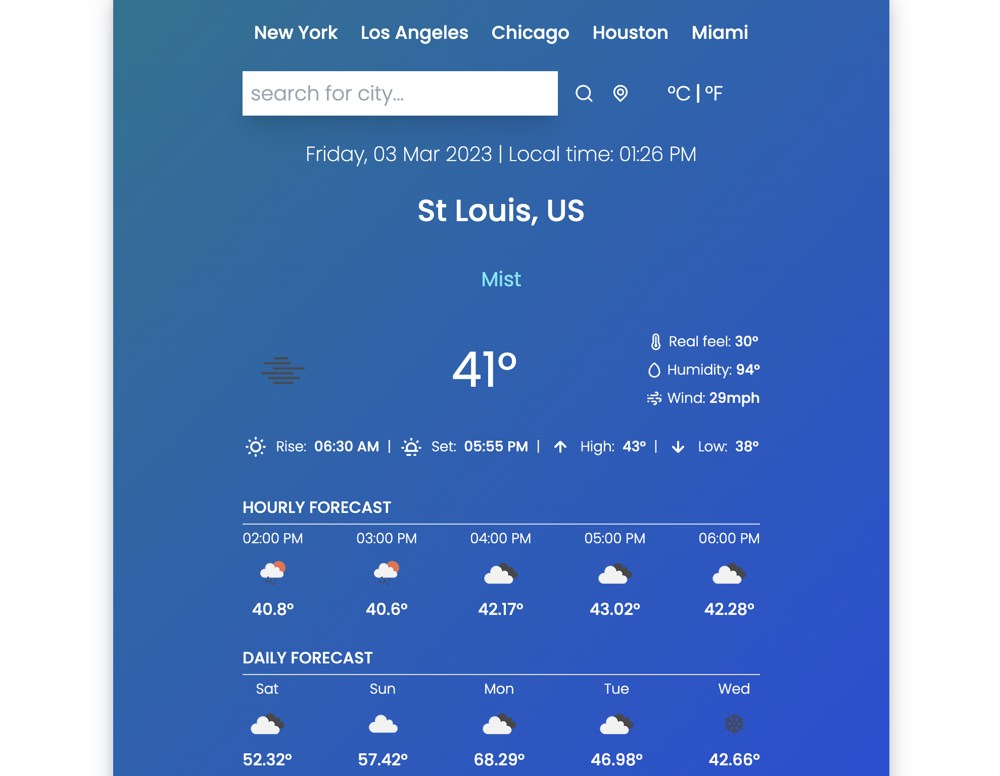

# Weatherman React

## License
### 
### [MIT](https://opensource.org/licenses/MIT)

## Description

* This is a react app that tells the weather using Openweather API. This app was created for better understanding of React and is a reapplication of a previous bootcamp assignment. This application has quick links, search, current location and displays information in both metric and imperial values.

By: [Vincent Toon](https://github.com/Vincenttoon)

## Table of Contents

* [Live Deployment](#live-deployment)

* [Technologies](Technologies)

* [Usage](#usage)  

* [Installation](#installation)

* [Questions?](#questions)

## Live Deployment

* [Live Deployment Link](https://weatherman-react.vercel.app/)

## Technologies

* [React](https://reactjs.org/) based application. Use states, effect and hooks to create a dynamic single page application.

* [Tailwind](https://tailwindcss.com/) was primarily used for format and styling. This was one my first applications of tailwind. Super smooth and easy to use. Dynamic and Versatile.

* [Luxon](https://www.npmjs.com/package/luxon) was used for date and time implementation. This package was much easier to use than the build in Javascript time functionality. Would definitely use again in the future.

* [Iconscout](https://iconscout.com/) was used for the icons. Pretty straight-forward. No better or worse than other icon stores I've used.

* [React-Toastify](https://www.npmjs.com/package/react-toastify) was used to inform users on fetching and success of searching for locations. Neat little feature to let the user know that the application is working on the API end. 

## Usage

* Use the live link. 
* Search for cities all over the world. 
* Change the values. 
* Enjoy.

## Installation

* Head to the repository to download or view this code: [Weatherman React](https://github.com/Vincenttoon/weatherman-react)

## Questions?

Questions, comments, or concerns? Please Email me at:
* vincenttoon22@gmail.com
